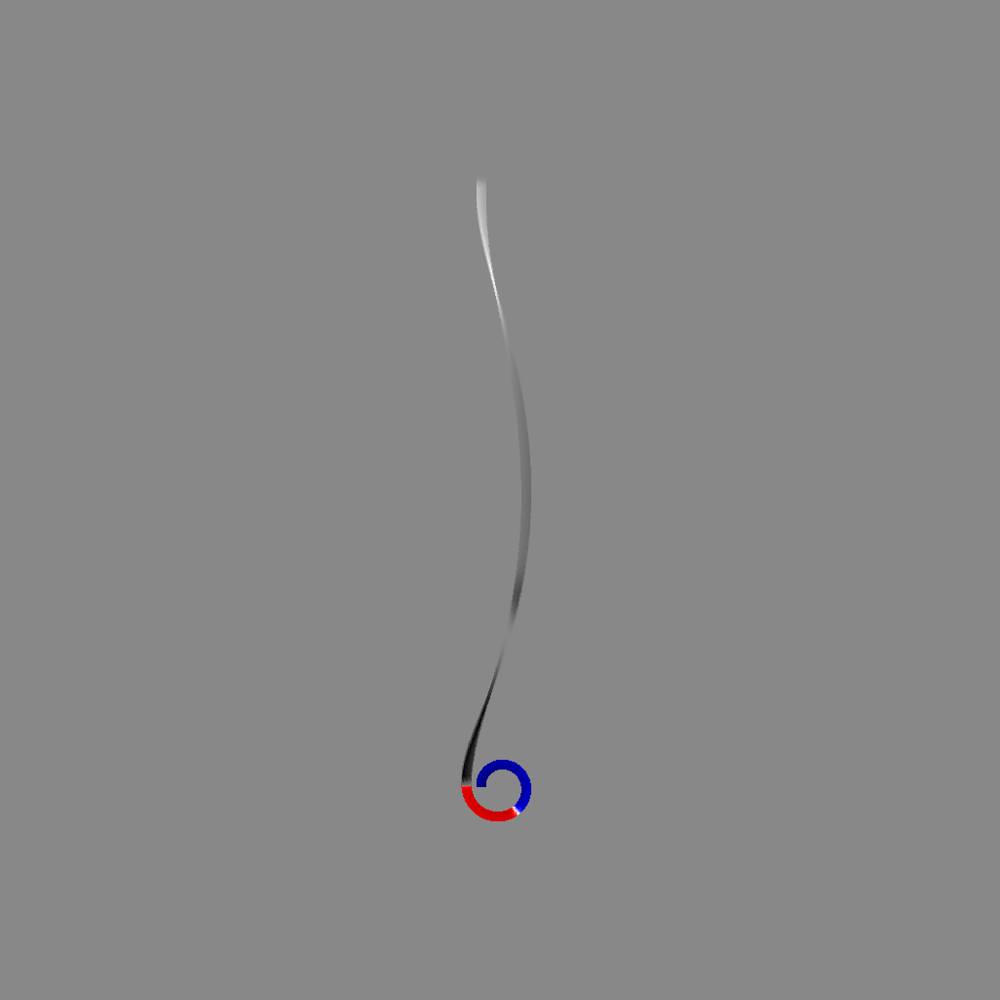

***************
Getting started
***************

.. include:: install.rst

Usage
====================

Microscope settings are defined in `settings.hjson` file and contain information about the microscope and basic slicing settings.

First, we load the structure and the settings:

.. sourcecode:: python

    from xmcd_projection import *

    msh_file = "example_mesh.msh"
    mag_file = "mag_data.csv"

    # get the mesh
    msh = Mesh.from_file(msh_file)
    # get the projection vector
    p = get_projection_vector(90, 16)

    # prepare raytracing object
    raytr = RayTracing(msh, p)
    raytr.get_piercings()
    struct = raytr.struct
    struct_projected = raytr.struct_projected

    # load magnetization and make sure the indices are not shuffled
    magnetisation, mag_points = load_mesh_magnetisation(mag_file)
    shuffle_indx = msh.get_shuffle_indx(mag_points)
    magnetisation = magnetisation[shuffle_indx, :]

    # get the colours and xmcd values
    xmcd_value = raytr.get_xmcd(magnetisation)
    mag_colors = get_struct_face_mag_color(struct, magnetisation)

    # define the visualizer parameters and show
    azi = 90
    center_struct = [0, 0, 0]
    dist_struct = 2e4
    center_peem = [0, -1000, 0]
    dist_peem = 2e5

    vis = MeshVisualizer(struct, struct_projected,
                        projected_xmcd=xmcd_value, struct_colors=mag_colors)
    vis.show(azi=azi, center=center_peem, dist=dist_peem)
    vis.start()

The raytracing and shuffle_indx can take a while to generate. It is useful to do it once for a structure and then save it:

.. sourcecode:: python

    np.save("raytracing.npy", raytr, allow_pickle=True)
    np.save("shuffle_indx.npy", shuffle_indx)

For loading:

.. sourcecode:: python

    raytr = np.load("raytracing.npy", allow_pickle=True).item()
    struct = raytr.struct
    struct_projected = raytr.struct_projected
    shuffle_indx = np.load("shuffle_indx.npy")

Shadow or the structure can be removed to focus on only one:

.. sourcecode:: python

    # only the projection
    vis.view_projection(azi=azi, center=center_peem, dist=dist_peem)
    # only the structure
    vis.view_struct(azi=azi, center=center_struct, dist=dist_struct)
    # show both
    vis.view_both(azi=azi, center=center_peem, dist=dist_peem)

